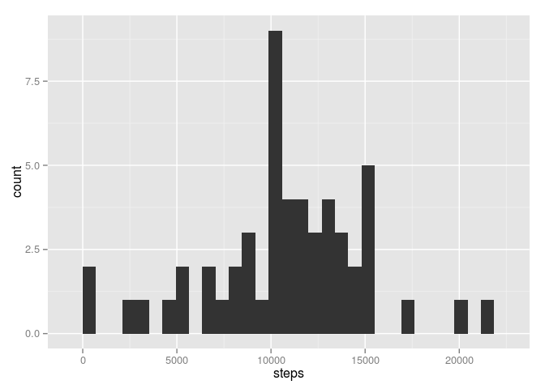
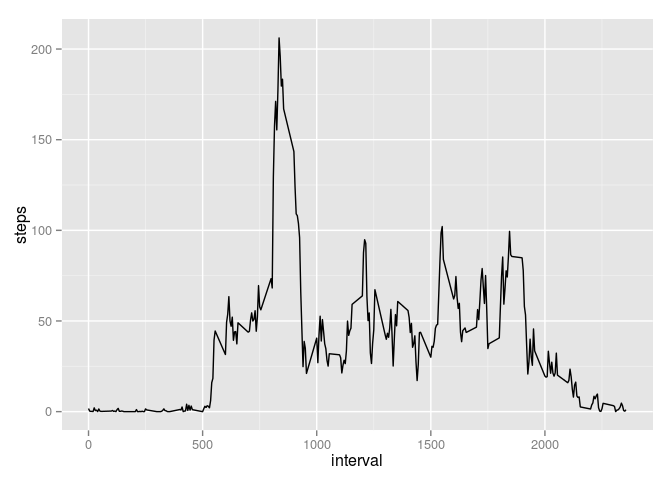
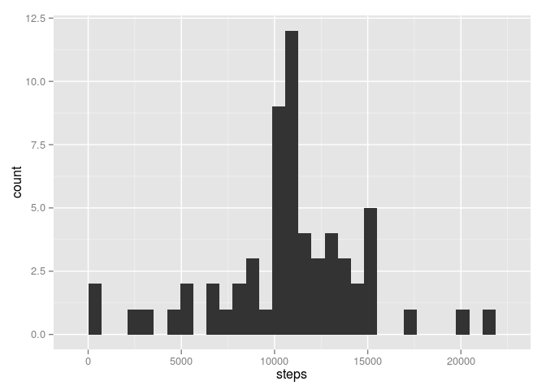
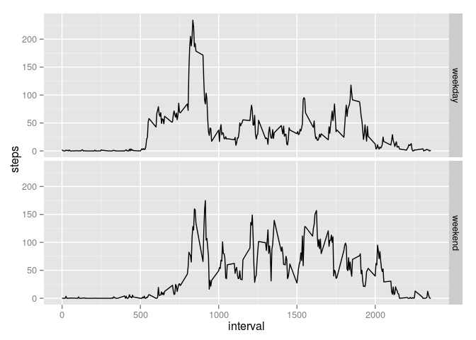

# Reproducible Research: Peer Assessment 1


## Loading and preprocessing the data


```r
# Load libraries
library(dplyr)
library(ggplot2)
# Load the data
activity = read.csv("activity.csv", colClasses = c("numeric", "Date", "numeric"))
```


## What is mean total number of steps taken per day?


```r
# Calculate the total number of steps taken per day
steps_taken_per_day = summarise(group_by(activity, date), steps=sum(steps))
# Make a histogram of the total number of steps taken each day
qplot(steps, data=steps_taken_per_day, geom="histogram")
```

 

```r
# Calculate and report the mean of the total number of steps taken per day
summarise(steps_taken_per_day, mean(steps, na.rm=TRUE))
```

```
## Source: local data frame [1 x 1]
## 
##   mean(steps, na.rm = TRUE)
## 1                  10766.19
```

```r
# Calculate and report the median of the total number of steps taken per day
summarise(steps_taken_per_day, median(steps, na.rm=TRUE))
```

```
## Source: local data frame [1 x 1]
## 
##   median(steps, na.rm = TRUE)
## 1                       10765
```


## What is the average daily activity pattern?


```r
# Make a time series plot of the 5-minute interval and the average number of steps taken
steps_taken_per_interval = summarise(group_by(activity, interval), steps=mean(steps, na.rm=TRUE))
qplot(interval, steps, data=steps_taken_per_interval, geom="line")
```

 

```r
# Which 5-minute interval, on average across all the days in the dataset, contains the maximum number of steps?
summarise(steps_taken_per_interval, which.max(steps))
```

```
## Source: local data frame [1 x 1]
## 
##   which.max(steps)
## 1              104
```

```r
# Get row 104
steps_taken_per_interval[104, ]
```

```
## Source: local data frame [1 x 2]
## 
##   interval    steps
## 1      835 206.1698
```


## Imputing missing values


```r
# Calculate and report the total number of missing values in the dataset
summarise(filter(activity, is.na(steps)), count=n())
```

```
##   count
## 1  2304
```

```r
# Create a new dataset that is equal to the original dataset but with the missing data filled in, 
# using the mean for that 5-minute interval.
activity_fixed = select(mutate(left_join(activity, steps_taken_per_interval, by="interval"), 
  steps = ifelse(is.na(steps.x), steps.y, steps.x)),
  steps, date, interval)
# Make a histogram of the total number of steps taken each day
steps_taken_per_day_fixed = summarise(group_by(activity_fixed, date), steps=sum(steps))
qplot(steps, data=steps_taken_per_day_fixed, geom="histogram")
```

 

```r
# Calculate and report the mean of the total number of steps taken per day
summarise(steps_taken_per_day_fixed, mean(steps, na.rm=TRUE))
```

```
## Source: local data frame [1 x 1]
## 
##   mean(steps, na.rm = TRUE)
## 1                  10766.19
```

```r
# Calculate and report the median of the total number of steps taken per day
summarise(steps_taken_per_day_fixed, median(steps, na.rm=TRUE))
```

```
## Source: local data frame [1 x 1]
## 
##   median(steps, na.rm = TRUE)
## 1                    10766.19
```


## Are there differences in activity patterns between weekdays and weekends?


```r
# Create a new factor variable in the dataset with two levels
steps_taken_per_interval_weekend = summarise(group_by(
  mutate(activity, weekend = ifelse(weekdays(date) %in% c("Saturday", "Sunday"), "weekend", "weekday")),
  interval, weekend),
  steps=mean(steps, na.rm=TRUE))
# Make a time series plot of the 5-minute interval and the average number of steps taken
qplot(interval, steps, data=steps_taken_per_interval_weekend, geom="line", facets = weekend ~ .)
```

 
